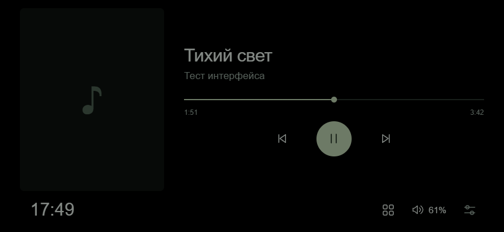
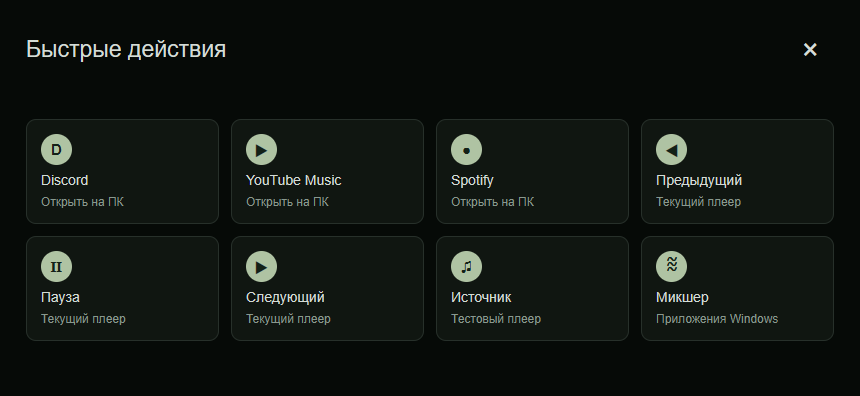
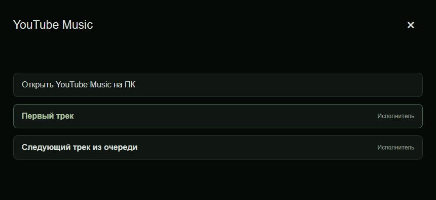
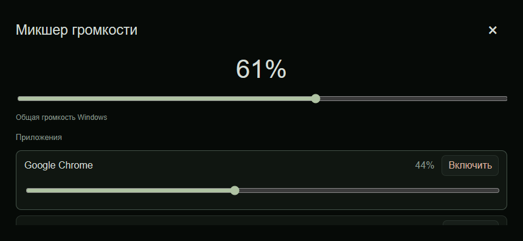

# Pixel Companion

Открытый музыкальный пульт для компьютера на старом **Google Pixel 4a без 5G**. Музыка и звук остаются на Windows; телефон показывает текущий трек и отправляет команды по локальной сети.

**v0.4.1 — рабочий исходный код прототипа и сборки для испытаний.** Windows получает медиасессии через GSMTC, а интерфейс работает с настоящим WebSocket-сервером. На физическом Pixel сборка ещё не проверена.









## Что входит

- Windows-программа в трее: текущий источник Windows или ручной выбор приложения, название, исполнитель, обложка, позиция и доступные команды.
- Play/pause, previous/next, перемотка (если поддерживается плеером), общая громкость и отдельный микшер приложений через Core Audio.
- Панель быстрых действий в стиле компактного Stream Deck: запуск Discord, YouTube Music и Spotify, transport-кнопки, выбор источника и микшер.
- Очередь открытого YouTube Music отображается на Pixel; касание трека передаётся обратно расширению и запускает именно этот пункт очереди в браузере.
- Для YouTube Music комплектное расширение Chrome/Edge берёт адрес обложки прямо из панели плеера и запрашивает у того же сервера изображения вариант 1200 × 1200. Windows передаёт полученный JPEG/PNG/WebP на Pixel без масштабирования и повторного сжатия. Для остальных плееров остаётся исходная картинка GSMTC.
- Привязка по одноразовому шестизначному коду, сохранение привязки, переподключение, подтверждения команд и защита от повторов.
- Android APK: поиск ПК в локальной сети, ручной адрес как запасной путь, горизонтальный полноэкранный WebView, USB-C слева или справа и яркость 5–100%.
- Экран по умолчанию не гаснет при простое. Чёрный экран включается вручную или при блокировке ПК; первое касание только пробуждает изображение. Для OLED остаются мягкое снижение яркости без касаний и небольшой сдвиг интерфейса.
- Тот же интерфейс доступен в браузере по адресу ПК. Для YouTube Music Windows загружает только прямой адрес большой обложки с Google/YouTube; сервисы поиска по названию трека не используются.

Климатический датчик, уведомления и загрузка ПК — следующий этап. В этой версии вымышленных показаний датчика нет.

## Запуск

1. Скачайте Windows ZIP из Releases и **распакуйте целиком** в постоянную папку. Запустите `PixelCompanion.exe`. .NET включён в архив, отдельная установка не нужна.
2. Если Windows запрашивает сетевой доступ, разрешите его для **частной домашней сети**. Программа использует TCP 8765 и UDP 8764 для обнаружения. Настройки защиты глобально менять не нужно.
3. Для большой обложки YouTube Music откройте `chrome://extensions`, включите режим разработчика, нажмите **«Загрузить распакованное расширение»** и выберите папку `browser-extension` из Windows-архива. Нажмите значок расширения → **«Подключить к Windows»** и разрешите Chrome доступ к локальной сети, если он спросит. Затем один раз обновите вкладку YouTube Music. Та же инструкция лежит в `browser-extension/INSTALL-RU.txt`.
4. Установите `PixelCompanion-0.4.0.apk` на Pixel. Android может попросить разрешить установку из выбранного источника. Это APK прототипа, не приложение из Play Store.
5. На телефоне нажмите **«Найти компьютер»**. Если поиск не сработал, введите адрес из окна Windows, например `192.168.1.100:8765`. ПК может быть подключён к роутеру Ethernet-кабелем, телефон — к Wi-Fi.
6. Введите одноразовый код из окна Windows. Код действует 5 минут; если истёк, нажмите **«Новый код»**. После успешной привязки код меняется, а телефон запоминает свой ключ.
7. Запустите музыку на компьютере. В окне агента можно включить **«Запускать вместе с Windows»**. Закрытие окна оставляет агент в трее; выход находится в контекстном меню значка.

APK также можно получить с работающего ПК: откройте на телефоне `http://АДРЕС_ПК:8765/PixelCompanion.apk`, если APK лежит рядом с EXE под именем `PixelCompanion.apk`. Для проверки до установки откройте просто адрес ПК в браузере.

Клавиша «Назад» в Android возвращает к настройке адреса. Это полноэкранное приложение, а не принудительный административный kiosk; телефон остаётся доступен владельцу.

## Ограничения прототипа

- **HTTP/WS без TLS**: используйте доверенную домашнюю сеть. Код привязки, токен и медиаданные не зашифрованы в сети. Не открывайте порт в Интернет и не используйте прототип в публичном Wi-Fi. Для постоянного использования нужен следующий этап с TLS и привязкой сертификата.
- GSMTC видит только то, что публикует сам плеер. Название программы не гарантирует поддержку обложки, длительности, перемотки или next/previous. Недоступные действия отключаются.
- Chrome передаёт через GSMTC только миниатюру YouTube Music около 60–120 px. Расширение решает это для YouTube Music, получая вариант 1200 × 1200 по адресу картинки, уже находящемуся на странице. Оно связывается только с локальным `127.0.0.1:8765`; название и исполнитель не отправляются сервисам поиска. Для других браузерных сайтов качество пока зависит от GSMTC.
- GSMTC не предоставляет каталог YouTube Music. Расширение добавляет выбор из текущей очереди вокруг играющего трека, но пока не передаёт на Pixel поиск, всю медиатеку и домашнюю ленту. Быстрый запуск ограничен встроенным безопасным списком и не выполняет произвольные команды с телефона.
- Список источников объединяет сессии одного `SourceAppUserModelId`. Независимый выбор нескольких сессий одного и того же приложения пока не реализован.
- Чёрный экран оставляет сенсор и приложение активными. В браузере яркость меняется визуально, в APK — через яркость окна Android. Максимальное положение ползунка соответствует 100% системной яркости окна.
- Windows-программа должна работать в пользовательском сеансе, а не как системная служба Session 0.
- APK подписан отдельным ключом прототипа. Сохраните свой ключ вне Git, если будете выпускать обновления самостоятельно. Стандартный пароль в скрипте относится к тестовой подписи, не к производственному ключу.

## Проверка на компьютере разработки

См. [VALIDATION.md](VALIDATION.md). Сборка успешно запускается на Windows: локальный сервер отвечает, системный микшер обнаруживает реальные сессии приложений, а команда установки приложению его текущей громкости проходит. Предыдущая проверка также получила настоящие название, исполнителя, обложку и позицию из браузерной медиасессии Windows; доставка команды Pause до отдельной тестовой сессии подтверждена её callback.

## Исходники

```text
apps/windows/   C# / .NET 10 / WinForms + Kestrel + Windows.Media.Control
apps/android/   Java / Android API 28+ / полноэкранный WebView
browser-extension/ Chrome/Edge Manifest V3 / исходная обложка YouTube Music
web/            общий интерфейс без npm-зависимостей
scripts/        воспроизводимая сборка Android APK без Android Studio
tests/          логика привязки, интерфейс и Windows GSMTC integration fixture
docs/           протокол
```

Android-оболочка написана на Java с системными API; интерфейс общий для APK и браузера. Устройство-компаньон можно проверять без корпуса.

### Windows

Нужен .NET 10 SDK:

```powershell
dotnet publish apps/windows/PixelCompanion.csproj -c Release -r win-x64 --self-contained true -o dist/windows
```

Рабочие файлы привязки сохраняются в `data/` рядом с EXE. В них хранятся хеши токенов; сами токены сервер на диск не записывает. `ready.json` содержит короткоживущий код для локальной диагностики. Не публикуйте `data/`.

### Android

Нужны JDK 17, Android SDK platform 35 и build-tools 35.0.0. Полный Android Studio и Gradle не обязательны:

```powershell
./scripts/build-android.ps1 -Jdk 'C:/jdk-17' -BuildTools 'C:/Android/Sdk/build-tools/35.0.0' -AndroidJar 'C:/Android/Sdk/platforms/android-35/android.jar' -WorkDirectory './build/android' -Output './dist/PixelCompanion.apk' -Keystore './private/prototype.jks'
```

Ключ и `private/` следует хранить вне публикуемого каталога. Скрипт выполняет javac → D8 → aapt2 → zipalign → apksigner и проверяет APK.

### Тесты

```powershell
dotnet run --project tests/CoreChecks
# В двух отдельных процессах Windows, без звука:
dist/windows/PixelCompanion.exe --headless --loopback --port 18765 --data-dir ./test-data/agent
dist/windows/PixelCompanion.exe --media-fixture --port 18766 --data-dir ./test-data/fixture
node tests/integration.cjs ./test-data/agent ./test-data/fixture
```

Integration-тест выбирает только сессию тестового процесса. Не запускайте его с повседневной музыкой в качестве фикстуры. В GitHub Actions выполняются сборка и изолированные проверки логики; настоящий GSMTC требует интерактивной Windows-сессии.

## Источники API

- [Microsoft: получение медиасессий и управление с другого устройства](https://devblogs.microsoft.com/oldnewthing/20231108-00/?p=108980)
- [Microsoft: вызов WinRT из .NET](https://learn.microsoft.com/en-us/windows/apps/desktop/modernize/desktop-to-uwp-enhance)
- [Microsoft: громкость Core Audio](https://learn.microsoft.com/en-us/windows/win32/api/endpointvolume/nf-endpointvolume-iaudioendpointvolume-setmastervolumelevelscalar)
- [Android: яркость окна](https://developer.android.com/reference/android/view/WindowManager.LayoutParams#screenBrightness)

MIT License.
